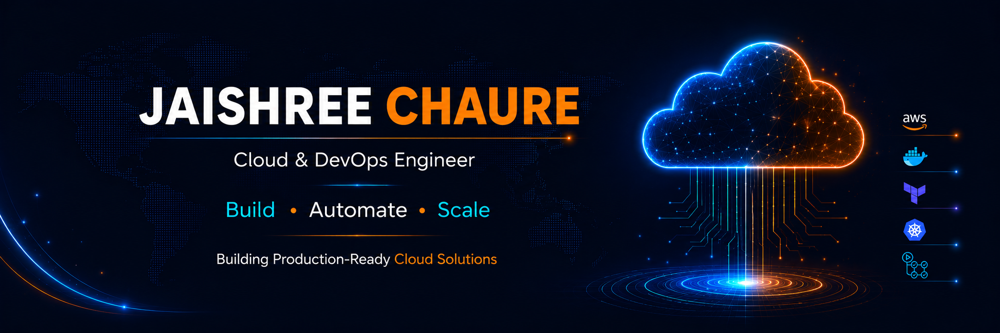

<!-- ============================================= -->
<!--                 GITHUB BANNER                 -->
<!-- ============================================= -->

  

 

<h1 align="center">
Hi, I'm Jaishree Chaure 👋
</h1>

<h3 align="center">
Cloud & DevOps Engineer
</h3>

AWS Certified Cloud Practitioner • Building Production-Ready Cloud Infrastructure

  

  

  

---

## 🚀 About Me

- AWS Certified Cloud Practitioner (CLF-C02).
- Passionate about Cloud Computing, DevOps, and Infrastructure Automation.
- Building real-world Cloud & DevOps projects using AWS and open-source technologies.
- Skilled in Python, MySQL, Linux, Git, and modern Cloud & DevOps tools.
- Interested in Infrastructure as Code (IaC), CI/CD, Containerization, Cloud Security, and Automation.
- Continuously learning through hands-on projects, technical documentation, and modern DevOps practices.
- Actively documenting and sharing my Cloud & DevOps journey on GitHub.

---

## 🛠️ Tech Stack

### ☁️ Cloud & DevOps

  

### 💻 Programming & Scripting

  

### 🐧 Operating Systems, Databases & Tools

  

### 📊 Monitoring & Observability

  

---

## 📚 Currently Learning

- Kubernetes Fundamentals
- Advanced Terraform Modules & Best Practices
- Monitoring & Observability
- Production-grade CI/CD Pipelines
- Infrastructure Automation
- Cloud Security Best Practices

---

## 🌱 Currently Building

- Production-ready Cloud Infrastructure projects.
- CI/CD pipelines using GitHub Actions.
- Terraform-based AWS infrastructure deployments.
- Linux administration and troubleshooting labs.
- Technical documentation for Cloud & DevOps concepts.
  
---

## 📌 Featured Projects

### 🚀 90 Days of DevOps
> My hands-on Cloud & DevOps learning journey.

- [90DaysOfDevOps](https://github.com/Jaishree97/90DaysOfDevOps)

---

### 💻 DevBoard
> Production-ready full-stack DevOps application built with modern engineering practices.

- [DevBoard](https://github.com/Jaishree97/devboard)
  - Go backend
  - PostgreSQL database
  - Docker & Docker Compose
  - GitHub Actions CI/CD
  - DevSecOps automation

---

### ☁️ Cloud & AWS Projects

> Hands-on AWS projects covering networking, compute, scalability, and web hosting.

- [AWS Static Website Hosting with S3 & CloudFront](https://github.com/Jaishree97/aws-static-website-s3-cloudfront)
- [EC2 Apache Web Server Setup](https://github.com/Jaishree97/ec2-apache-web-server)
- [AWS Application Load Balancer & Auto Scaling Project](https://github.com/Jaishree97/aws-alb-auto-scaling-project)
- [AWS VPC Networking Lab](https://github.com/Jaishree97/aws-vpc-networking-lab)
- [AWS Elastic Network Interface (ENI) Lab](https://github.com/Jaishree97/aws-eni-lab)

---

### 🏗️ Terraform Projects

> Infrastructure as Code (IaC) projects built using Terraform and AWS.

- [TerraWeek](https://github.com/Jaishree97/TerraWeek)

---

### ⚡ GitHub Actions Projects

> Hands-on GitHub Actions workflows, CI/CD automation, and production-ready DevSecOps projects.

- [GitHub Actions Practice](https://github.com/Jaishree97/github-actions-practice)
  - Workflow basics, triggers, matrices, runners, artifacts, caching, secrets, and reusable workflows.

- [GitHub Actions Capstone](https://github.com/Jaishree97/github-actions-capstone) ⭐
  - Production-style CI/CD pipeline featuring reusable workflows, Docker image builds, automated testing, Trivy security scanning, Dependabot, SARIF security reporting, artifacts, and deployment automation.

---

### 🐧 Linux Projects

> Linux administration, monitoring, and troubleshooting labs.

- [Linux Monitoring & Troubleshooting Lab](https://github.com/Jaishree97/linux-monitoring-troubleshooting-lab)
- [Nginx & HTTPD Troubleshooting Lab](https://github.com/Jaishree97/nginx-httpd-troubleshooting-lab)

---

### 📚 DevOps Notes Repository

> Technical notes, hands-on labs, cheat sheets, and Cloud & DevOps documentation.

- [DevOps Notes](https://github.com/Jaishree97/DevOps-Notes)

---

## 🏆 Certifications

- AWS Certified Cloud Practitioner (CLF-C02)
- AWS re/Start Graduate
- Python Certification
- SQL Certification
- Git & GitHub Certification

  

---

## 💼 Open To Opportunities

- Cloud Engineer
- DevOps Engineer
- Cloud Support Engineer
- Platform Engineer
- Site Reliability Engineer (Entry-Level)

---

## 📊 GitHub Statistics

  

  

  

---

## 📈 Contribution Graph

---

## 🐍 Contribution Snake

---

## 🤝 Let's Connect

  

  

  

---

## 🎯 Career Goal

> To become a production-ready Cloud & DevOps Engineer capable of designing, automating, securing, and managing scalable cloud infrastructure and modern CI/CD systems.

---

## 🚀 Why This GitHub Exists

This GitHub is my Cloud & DevOps engineering portfolio—where I learn, build, document, and automate real-world projects.

Every repository reflects practical learning, hands-on experimentation, and continuous improvement as I work toward becoming a production-ready Cloud & DevOps Engineer.

My focus is simple:

- Learn continuously.
- Build production-ready projects.
- Share technical knowledge.
- Automate repetitive tasks.
- Grow as a Cloud & DevOps Engineer.

> Learn. Build. Automate. Deploy. Repeat.

---
