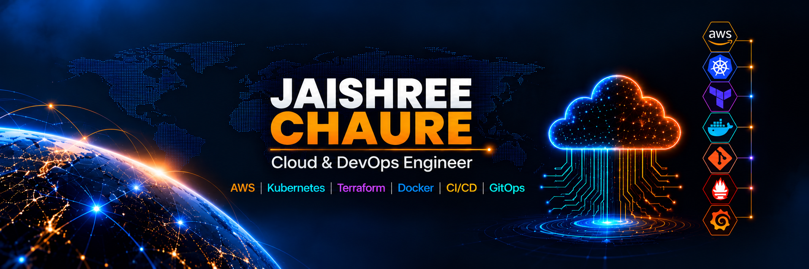

<!-- ============================================= -->
<!--                 GITHUB BANNER                 -->
<!-- ============================================= -->

  

 

<h1 align="center">
Hi, I'm Jaishree Chaure 👋
</h1>

<h3 align="center">
Cloud & DevOps Engineer
</h3>

AWS Certified Cloud Practitioner • Cloud Infrastructure • DevOps • Automation

  

  

  

---

## 🚀 About Me

I'm a **Cloud & DevOps Engineer** focused on building, automating, and troubleshooting cloud infrastructure and production-ready environments.

I have hands-on experience with **AWS, Terraform, Docker, Kubernetes, Amazon EKS, GitHub Actions, Helm, Argo CD, Linux, Git, and Infrastructure as Code.**

My work focuses on:

- ☁️ Cloud infrastructure and automation
- 🏗️ Infrastructure as Code
- 🐳 Containerization and orchestration
- 🔄 CI/CD automation
- 🔁 GitOps deployments
- 📊 Monitoring and observability
- 🤖 AI-assisted DevOps and troubleshooting
- 🐧 Linux administration and troubleshooting

I document my hands-on work through real-world projects, technical notes, labs, and my **90 Days of DevOps** portfolio.

---

## 🛠️ Tech Stack

### ☁️ Cloud & DevOps

  

### 💻 Programming & Scripting

  

### 🐧 Operating Systems, Databases & Tools

  

### 📊 Monitoring & Observability

  

---

## 💡 What I Work With

| Area | Technologies |
|------|--------------|
| ☁️ Cloud | AWS, EC2, S3, IAM, VPC, ALB, Auto Scaling, CloudFront, Route 53 |
| 🏗️ IaC | Terraform |
| 🐳 Containers | Docker, Docker Compose |
| ☸️ Kubernetes | Kubernetes, Amazon EKS, Helm |
| 🔄 CI/CD | GitHub Actions |
| 🔁 GitOps | Argo CD |
| 📊 Observability | Prometheus, Grafana, Loki |
| 🐧 Linux | Administration, networking, permissions, processes, troubleshooting |
| 🤖 Automation | Python, Bash |
| 🔧 Version Control | Git, GitHub |

---

## 📌 Featured Projects

### 🚀 90 Days of DevOps

> A hands-on Cloud & DevOps engineering portfolio covering the journey from **Linux and networking to production-ready cloud infrastructure, GitOps, observability, and AI-assisted DevOps.**

**Linux → Networking → Git → Docker → AWS → Terraform → CI/CD → Kubernetes → Helm → GitOps → Observability → AIOps**

Key implementations include:

- AWS infrastructure and networking
- Terraform Infrastructure as Code
- Docker containerization
- GitHub Actions CI/CD
- Kubernetes & Amazon EKS
- Helm application packaging
- Argo CD GitOps deployments
- Prometheus, Grafana & Loki observability
- AI-assisted Kubernetes troubleshooting

🔗 [90 Days of DevOps](https://github.com/Jaishree97/90DaysOfDevOps)

---

### 💻 DevBoard

> Production-ready full-stack application demonstrating **containerization, CI/CD, Kubernetes, GitOps, DevSecOps, and AI-assisted DevOps**.

**Tech:** Go • PostgreSQL • Docker • GitHub Actions • Kubernetes • Helm • Argo CD

- 🐳 Containerized application with Docker & Docker Compose
- 🔄 Automated CI/CD with GitHub Actions
- ☸️ Kubernetes deployment with Helm
- 🔁 GitOps deployment using Argo CD
- 🔐 DevSecOps security scanning
- 🤖 AI-assisted troubleshooting and automation

🔗 [DevBoard](https://github.com/Jaishree97/devboard)

### 🤖 KubeHealer

> AI-assisted Kubernetes troubleshooting and automated recovery project.

**Tech:** Kubernetes • Python • Temporal • Claude • Docker

- Kubernetes health monitoring
- AI-assisted issue diagnosis
- Automated remediation
- Temporal-based workflows
- Fault recovery and troubleshooting

---

## ☁️ AWS Projects

> Hands-on AWS projects covering compute, networking, scalability, storage, and web hosting.

- [AWS Static Website Hosting with S3 & CloudFront](https://github.com/Jaishree97/aws-static-website-s3-cloudfront)
- [EC2 Apache Web Server Setup](https://github.com/Jaishree97/ec2-apache-web-server)
- [AWS Application Load Balancer & Auto Scaling Project](https://github.com/Jaishree97/aws-alb-auto-scaling-project)
- [AWS VPC Networking Lab](https://github.com/Jaishree97/aws-vpc-networking-lab)
- [AWS Elastic Network Interface (ENI) Lab](https://github.com/Jaishree97/aws-eni-lab)

---

## 🏗️ Terraform Projects

> Infrastructure as Code projects focused on provisioning and managing AWS infrastructure using Terraform.

- [TerraWeek](https://github.com/Jaishree97/TerraWeek)

---

## ⚡ CI/CD & GitHub Actions

> Hands-on CI/CD automation and DevSecOps workflows using GitHub Actions.

### GitHub Actions Capstone ⭐

Production-style CI/CD pipeline featuring:

- Reusable workflows
- Docker image builds
- Automated testing
- Trivy security scanning
- Dependabot
- SARIF security reporting
- Artifacts
- Deployment automation

🔗 [GitHub Actions Capstone](https://github.com/Jaishree97/github-actions-capstone)

---

## 🐧 Linux Projects

> Hands-on Linux administration, monitoring, and troubleshooting labs.

- [Linux Monitoring & Troubleshooting Lab](https://github.com/Jaishree97/linux-monitoring-troubleshooting-lab)
- [Nginx & HTTPD Troubleshooting Lab](https://github.com/Jaishree97/nginx-httpd-troubleshooting-lab)

---

## 📚 DevOps Notes Repository

> Technical notes, hands-on labs, cheat sheets, and Cloud & DevOps documentation.

- [DevOps Notes](https://github.com/Jaishree97/DevOps-Notes)

---

## 🏆 Certifications

- Certified DevOps Engineer Associate
- AWS Certified Cloud Practitioner (CLF-C02)
- AWS re/Start Graduate
- Python Certification
- SQL Certification
- Git & GitHub Certification

  

---

## 💼 Open To Opportunities

I'm currently open to opportunities in:

- **DevOps Engineer**
- **Junior DevOps Engineer**
- **Cloud Engineer**
- **Cloud Support Engineer**
- **Cloud Operations Engineer**
- **Platform Engineer**

Open to **full-time Cloud & DevOps opportunities**.

---

## 📊 GitHub Statistics

  

  

  

---

## 📈 Contribution Graph

---

## 🐍 Contribution Snake

---

## 🤝 Let's Connect

  

  

  

---

## 🚀 Why This GitHub Exists

This GitHub is my **Cloud & DevOps engineering portfolio** — where I build, automate, troubleshoot, and document real-world projects.

My focus:

- Build practical projects
- Automate repetitive tasks
- Improve troubleshooting skills
- Document technical learning
- Work with production-oriented cloud and DevOps practices

> **Learn. Build. Automate. Deploy. Improve.**

---
